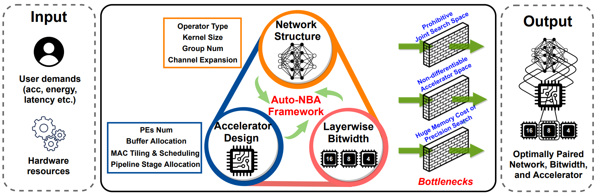
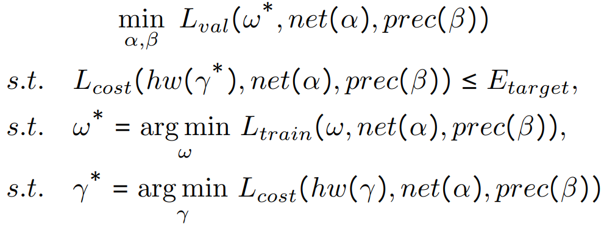
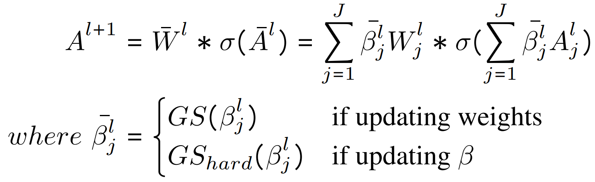
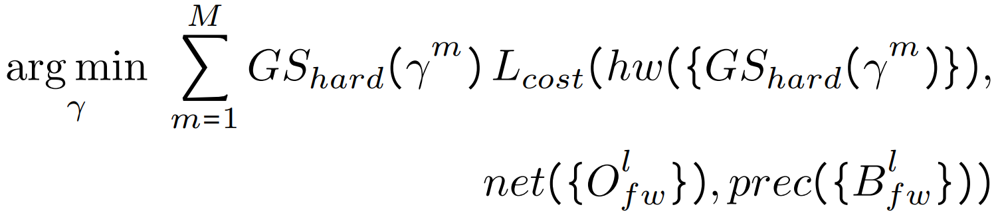
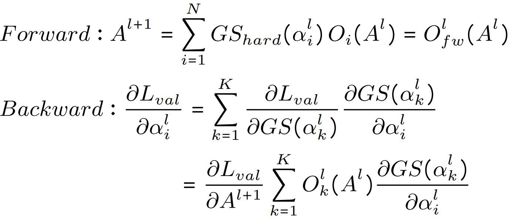
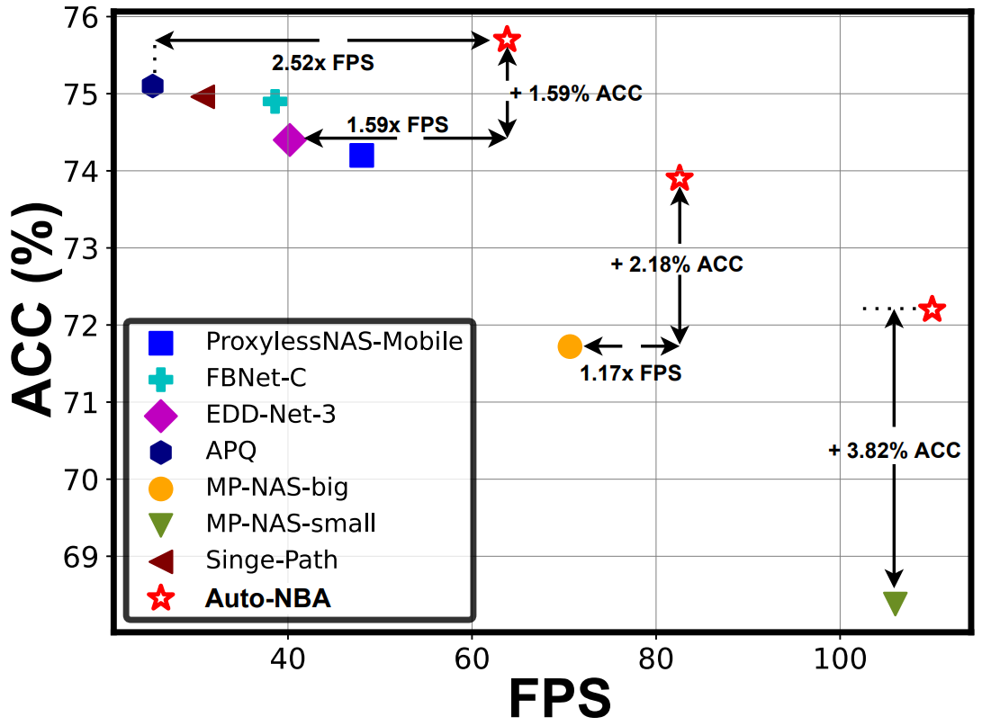

# Auto-NBA: Efficient and Effective Search Over the Joint Space of Networks, Bitwidths, and Accelerators
***Yonggan Fu***, Yongan Zhang, Yang Zhang, David Cox, Yingyan Lin

Accepted at ICML 2021 [[Paper Link]](https://arxiv.org/pdf/2106.06575.pdf).


## Overview

- While maximizing deep neural networks’ (DNNs’) acceleration efficiency requires a joint search/design of three different yet highly coupled aspects, including the networks, bitwidths, and accelerators, the challenges associated with such a joint search have not yet been fully understood and addressed. To tackle these daunting challenges towards optimal and fast development of DNN accelerators, we propose a framework dubbed ***Auto-NBA*** to enable ***jointly searching for the Networks, Bitwidths, and Accelerators***, by efficiently localizing the optimal design within the huge joint design space for each target dataset and acceleration specification.

<p align="center">
  
</p>


## Method

### Problem Formulation

- Our Auto-NBA targets a scalable yet generic joint search framework, which we formulate as a bi-level optimization problem:

<p align="center">
  
</p>


### Heterogeneous Sampling for Bit-wise Search

- To tackle the dilemma between memory explosion or biased search of bit-wise search, we propose a simple yet effective heterogeneous sampling strategy:

<p align="center">
  
</p>

### Differentiable Accelerator Search Engine

- We propose a differentiable search engine to efficiently search for the optimal accelerator (including the micro-architectures and mapping methods) given a
DNN and its precision:

<p align="center">
  
</p>

### Overall Joint Search Framework

- We propose the single-path forward / multi-path backward strategy during joint search and acquire the layer/block-wise hardware cost using the single-path network derived from the current forward as a proxy of the finally derived network, which tackles (1) the prohibitively large joint space, (2) the entangled co-adaptation and cooperation issues among different network and precision choices, and (3) the chicken-and-egg problem associated with network-accelerator co-search.


<p align="center">
  
</p>


## Results

-  The searched networks by our Auto-NBA consistently push forward the frontier of accuracy-FPS trade-offs, compared to all SOTA baselines. For example, compared with the most relevant baseline EDD, we achieve a +1.3% higher accuracy together with a 1.59× better FPS. 

<p align="center">
  
</p>


## Code Usage
- A two-stage process is needed to generate the matched network/bitwidth/accelerator solutions, i.e., the search and training stage. The corresponding settings are specified in ***config_search.py*** and ***config_train.py***, respectively. In particular, plz specify the search settings in ***config_search.py*** and search the optimal network/bitwidth/accelerator solutions through ***train_search.py***. Next, specify training settings in ***config_train.py*** and train the searched network/bitwidth from scratch through ***train.py*** (The best searched arch will be saved at ***ckpt/search/arch.pt*** which is the default path for ***train.py*** to read.)

### Prerequisites
- See ***env.yml*** for the complete conda environment. Create a new conda environment:
```
conda env create -f env.yml
conda activate pytorch
```

### The Search Stage
1. Specify the search setting in ***config_search.py***:
```
C.dataset_path = "path-to-dataset"
C.latency_weight = 1e-10
```

2. Run ***train_search.py***: 
```
python train_search.py
```

### The Training Stage
1. Specify the training setting in ***config_train.py***:
```
C.dataset_path = "path-to-dataset"
C.load_path = "path-to-searched-arch"
```

2. Run ***train.py*** on each of your nodes: 
```
python train.py
```

## Citation
```
@article{fu2021auto,
  title={Auto-NBA: Efficient and Effective Search Over the Joint Space of Networks, Bitwidths, and Accelerators},
  author={Fu, Yonggan and Zhang, Yongan and Zhang, Yang and Cox, David and Lin, Yingyan},
  journal={arXiv preprint arXiv:2106.06575},
  year={2021}
}
```

